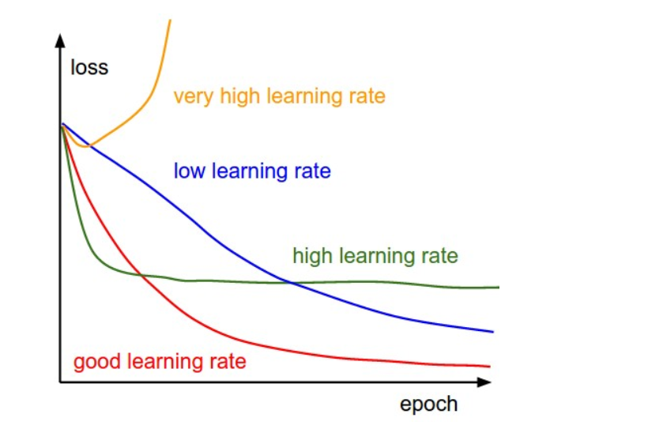
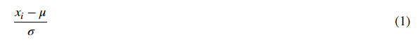
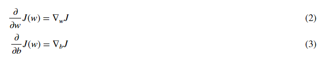
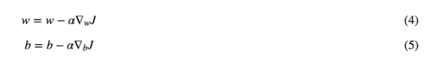
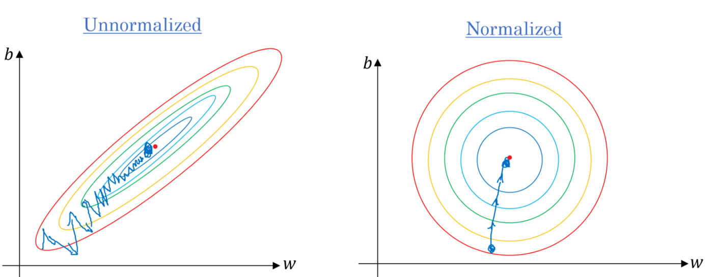

# Gradient-Descent-Algorithms
A collection of various gradient descent algorithms implemented in Python from scratch

# Introduction
Gradient descent is a first-order iterative optimization algorithm for finding a local minimum of a differentiable function. To find a local minimum of a function using gradient descent, we take steps proportional to the negative of the gradient (or approximate gradient) of the function at the current point. But if we instead take steps proportional to the positive of the gradient, we approach a local maximum of that function; the procedure is then known as gradient ascent. Gradient descent was originally proposed by Cauchy in 1847. 

# Gradient Descent Algorithms (Included here)
1) Basic Gradient Descent
2) Gradient Descent with Decaying Learning Rate
3) Line Search Gradient Descent
4) Momentum Based Gradient Descent Algorithm
5) Nesterov Accelerated Gradient Descent Algorithm
6) RMSProp
7) Adagrad
8) Adam

# Understanding the Basic Gradient Descent
Gradient Descent is the most common optimization algorithm in machine learning and deep learning. It is a first-order optimization algorithm. This means it only takes into account the first derivative when performing the updates on the parameters. On each iteration, we update the parameters in the opposite direction of the gradient of the objective function J(w) w.r.t the parameters where the gradient gives the direction of the steepest ascent. The size of the step we take on each iteration to reach the local minimum is determined by the learning rate α. Therefore, we follow the direction of the slope downhill until we reach a local minimum.

Let’s first see how gradient descent works on logistic regression before going into the details of its variants. For the sake of simplicity, let’s assume that the logistic regression model has only two parameters: weight w and bias b.
1. Initialize weight w and bias b to any random numbers.
2. Pick a value for the learning rate α. The learning rate determines how big the step would be on each iteration.
If α is very small, it would take long time to converge and become computationally expensive.
If α is large, it may fail to converge and overshoot the minimum.
Therefore, plot the cost function against different values of α and pick the value of α that is right before the first value that didn’t converge so that we would have a very fast learning algorithm that converges. 

The most commonly used rates are : 0.001, 0.003, 0.01, 0.03, 0.1, 0.3.
3. Make sure to scale the data if it’s on a very different scales. If we don’t scale the data, the level curves (contours) would be narrower and taller which means it would take longer time to converge.

Scale the data to have μ = 0 and σ = 1. Below is the formula for scaling each example:

4. On each iteration, take the partial derivative of the cost function J(w) w.r.t each parameter (gradient):

The update equations are:

For the sake of illustration, let’s assume we don’t have bias. If the slope of the current value of w > 0, this means that we are to the right of optimal w*. Therefore, the update will be negative, and will start getting close to the optimal values of w*. However, if it’s negative, the update will be positive and will increase the current values of w to converge to the optimal values of w*

Few things must be kept in mind:
1. Continue the process until the cost function converges. That is, until the error curve becomes flat and doesn’t change.
2. In addition, on each iteration, the step would be in the direction that gives the maximum change since it’s perpendicular to level curves at each step.

# Features of Repository
1) All variations of Gradient Descent Algorithms have been implemented from Scratch using Python only for better understanding
2) Added real world examples of usage of each algorithm
3) Continious monitoring of Loss and Accuracy for understanding rate and time taken by akgorithm to converge.
4) Plots for error surface which helps in visualization of the algorithm per epoch or iteration.

# References
1) **The Basic understanding of Gradient Descent** Source: https://towardsdatascience.com/gradient-descent-algorithm-and-its-variants-10f652806a3
2) **Basic Gradient Descent Algorithms** Source: https://arxiv.org/abs/1609.04747
3) **Gradient Descent with Decaying Learning Rate** Source: https://arxiv.org/abs/1212.5701
4) **RMSProp Algorithm** Source: http://www.cs.toronto.edu/~tijmen/csc321/slides/lecture_slides_lec6.pdf
5) **AdaGrad Algorithm** Source: http://www.jmlr.org/papers/volume12/duchi11a/duchi11a.pdf
